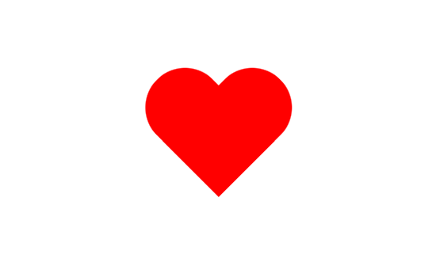
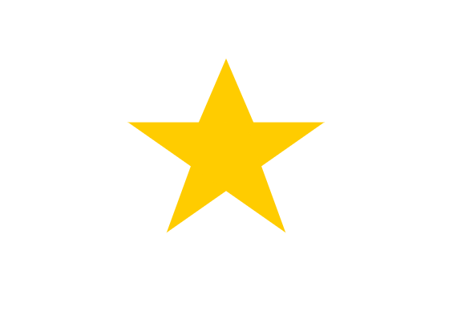
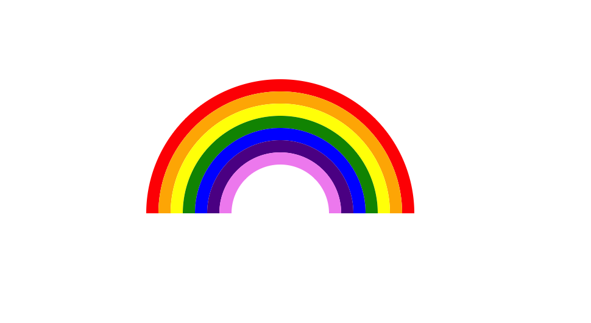
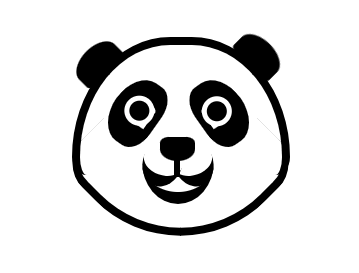
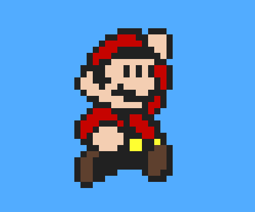
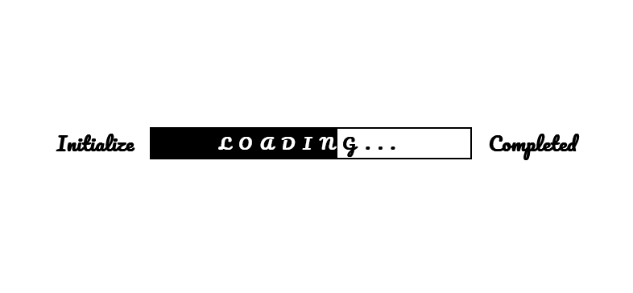
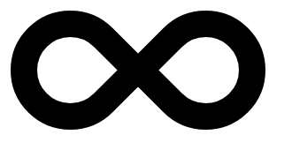

# You Don't Need Image or SVG

## What is you don't need Image?

CSS is powerful and can be used to make interesting UI elements for which most of the time people use Image for SVG files. In this repository we are curating those Advanced UIs' that are possible with CSS.

Note: Please, Feel free to add CSS Animations too.

Inspired by [You don't need JavaScript](https://github.com/you-dont-need/You-Dont-Need-JavaScript).

---

# Examples

### 1. CSS Heart

**[⬆ back to top](#examples)**

### 2. CSS Smile

**[⬆ back to top](#examples)**

### 3. CSS Star

**[⬆ back to top](#examples)**

### 4. CSS Eye Emoji

### 5. CSS Rainbow

**[⬆ back to top](#examples)**

### 5. CSS Panda

**[⬆ back to top](#examples)**

### 6. Mario

**[⬆ back to top](#examples)**

### 7. Snow

**[⬆ back to top](#examples)**

### 8. Penguin

**[⬆ back to top](#examples)**

### 9. Loading Bar(Animation)

**[⬆ back to top](#examples)**

### 10. Infinity

**[⬆ back to top](#examples)**

### 11. Cat

**[⬆ back to top](#examples)**

---

# Contribution Guide

1. Clone this repository with the following command: `https://github.com/akshaykhale1992/You-Dont-Need-image.git`
2. Add your HTML File to the examples directory.
3. Add the screenshot to the images directory.
4. Add the link to your HTML (or you can add the codepen link) to the [examples](#examples) in the readme.md file.
5. Raise the PR.

---

# Contributors

